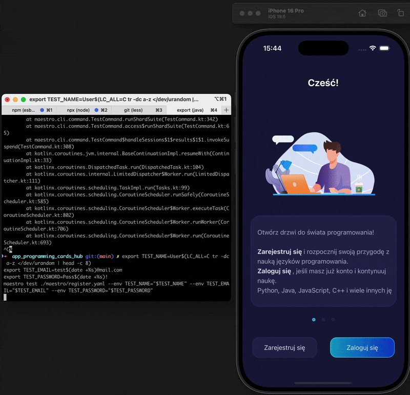

# 📱 app_programming_cards_hub

An Expo SDK 54 React Native application built with modern libraries, animations, and navigation.  
This app provides an interactive card-based programming hub with authentication and secure storage.  

---

## 🚀 Getting Started

### 1️⃣ Prerequisites
- [Node.js](https://nodejs.org/) (LTS recommended)
- [Expo CLI (new)](https://docs.expo.dev/more/expo-cli/)  
- [Android Studio](https://developer.android.com/studio) or [Xcode](https://developer.apple.com/xcode/) (for device emulators)
- [Yarn](https://yarnpkg.com/) or npm

### 2️⃣ Installation
Clone the repository and install dependencies:

```bash
git clone https://github.com/yourusername/app_programming_cards_hub.git
cd app_programming_cards_hub
yarn install
```

## 🧪 End-to-End Tests (Maestro)

We use [Maestro](https://maestro.mobile.dev/) for mobile E2E testing.

### Run registration test
```bash
export TEST_NAME=User$(LC_ALL=C tr -dc a-z </dev/urandom | head -c 8)
export TEST_EMAIL=test$(date +%s)@mail.com
export TEST_PASSWORD=Pass$(date +%s)!

maestro test ./maestro/register.yaml   --env TEST_NAME="$TEST_NAME"   --env TEST_EMAIL="$TEST_EMAIL"   --env TEST_PASSWORD="$TEST_PASSWORD"
```

---

## 🎥 Demo (E2E & Features)

### Registration E2E Test
Example of end-to-end registration process:  


### Core Functionality
- Card blocked  
  

- Flip card animation  
  

---
### 3️⃣ Running the app
Start the Expo development server:

```bash
# Start Metro bundler
yarn start

# Run on Android
yarn android

# Run on iOS
yarn ios
---
## 📦 Tech Stack

- **Framework:** [Expo SDK 54](https://docs.expo.dev/) + React Native 0.81
- **Navigation:** React Navigation (Bottom Tabs + Native Stack)
- **UI & Styling:** NativeWind (Tailwind CSS), Lottie animations, Expo Blur
- **State & Forms:** React Hook Form, Async Storage
- **Graphics:** React Native Skia, D3.js
- **APIs:** Axios, Expo Secure Store, Notifications
- **Icons:** Expo Vector Icons, FontAwesome
- **Testing:** Maestro E2E
- **Dev Tools:** TypeScript, TailwindCSS plugins, Metro bundler

---

## 📄 Scripts

Common npm/yarn scripts available:

```json
"start": "expo start",
"android": "expo run:android",
"ios": "expo run:ios",
"web": "expo start --web"
```

---

## 🛠️ Development Notes

- Ensure you have the correct Expo Go version for SDK 54.
- Large GIFs may take time to load in GitHub README; keep them optimized.
- For iOS, make sure you run `pod install` in the `ios/` directory if you eject.

---

## 📜 License
This project is private.  
For usage inquiries, please contact the maintainers.
